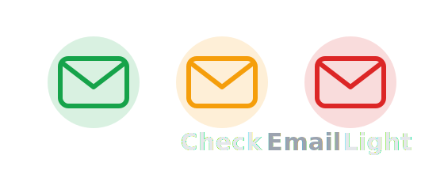

An automated inbox digest tool that reads your Gmail, scores each email for sentiment and urgency, and delivers a structured catch-up summary as a Windows toast notification and an HTML email.

---

## How it works

```
Gmail (live or mock)
    │
    ▼
Sentiment analysis          ← twitter-roberta-base (HuggingFace)
    │
    ▼
AI briefing generation      ← Claude Haiku (Anthropic)
    │
    ├──▶ Windows toast notification  (winotify)
    └──▶ HTML digest email           (Resend)
```

1. **`src/gmail.py`** — fetches unread emails from the Gmail Primary tab via the Gmail API (or returns mock data when `USE_LIVE_GMAIL = False`).
2. **`src/sentiment.py`** — scores each email body with `cardiffnlp/twitter-roberta-base-sentiment-latest`.
3. **`src/briefing.py`** — passes all emails + sentiment scores to Claude Haiku, which returns a structured `InboxDigest` (summary, attention items, to-dos, ignorable emails, urgency level).
4. **`src/notify.py`** — fires a Windows toast with a red/yellow/green indicator matching the urgency level.
5. **`src/sender.py`** — emails the digest as HTML via Resend.

---

## Setup

### 1. Install dependencies

```bash
pip install -r requirements.txt
```

### 2. Configure environment variables

Create a `.env` file in the project root:

```env
ANTHROPIC_API_KEY=sk-ant-...
RESEND_API_KEY=re_...
GOOGLE_CLIENT_ID=...
GOOGLE_CLIENT_SECRET=...
GOOGLE_REFRESH_TOKEN=...
```

### 3. Get a Gmail refresh token (first-time only)

Run the helper script and paste the printed refresh token into `.env`:

```bash
python get_token.py
```

This opens a browser OAuth flow and prints `GOOGLE_REFRESH_TOKEN` to the console.

---

## Running

### One-off run

```bash
python main.py
```

### Scheduled via Windows Task Scheduler

Double-click `run_digest.bat` or point Task Scheduler at it.

---

## Switching between live Gmail and mock data

In [src/gmail.py](src/gmail.py), change the flag at the top of the file:

```python
USE_LIVE_GMAIL = False  # False = sample emails, True = real inbox
```

Mock emails live in [data/sample_emails.py](data/sample_emails.py) and cover the full range of sentiment/urgency cases (urgent, positive, passive-aggressive, spam, etc.).

---

## Project structure

```
CheckEmailLight/
├── main.py                 # Entry point
├── get_token.py            # One-time OAuth token helper
├── run_digest.bat          # Batch launcher for Task Scheduler
├── requirements.txt
├── .env                    # API keys (not committed)
├── src/
│   ├── pipeline.py         # Orchestrates the full flow
│   ├── gmail.py            # Email fetching (live + mock)
│   ├── sentiment.py        # RoBERTa sentiment classifier
│   ├── briefing.py         # Claude Haiku digest generation
│   ├── schema.py           # Pydantic output schema (InboxDigest)
│   ├── sender.py           # Resend email delivery
│   └── notify.py           # Windows toast notification
└── data/
    └── sample_emails.py    # Mock inbox for testing
```

---

## Environment variables reference

| Variable               | Description                                    |
| ---------------------- | ---------------------------------------------- |
| `ANTHROPIC_API_KEY`    | Anthropic API key for Claude Haiku             |
| `RESEND_API_KEY`       | Resend API key for outbound email              |
| `GOOGLE_CLIENT_ID`     | OAuth 2.0 client ID from Google Cloud Console  |
| `GOOGLE_CLIENT_SECRET` | OAuth 2.0 client secret                        |
| `GOOGLE_REFRESH_TOKEN` | Long-lived refresh token (from `get_token.py`) |

---

## Requirements

- Windows (for toast notifications via `winotify`)
- Python 3.10+
- A Google Cloud project with the Gmail API enabled and OAuth credentials configured for a desktop app
